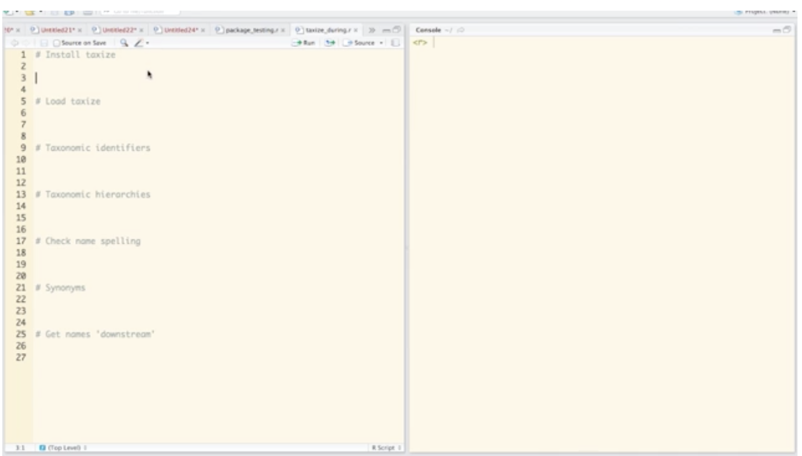

taxize
======

```{r echo=FALSE}
knitr::opts_chunk$set(
  warning = FALSE,
  message = FALSE,
  collapse = TRUE,
  comment = "#>"
)
```


[](https://cranchecks.info/pkgs/taxize)
[](https://travis-ci.org/ropensci/taxize)
[](https://ci.appveyor.com/project/sckott/taxize-175/branch/master)
[](https://codecov.io/github/ropensci/taxize?branch=master)
[](https://github.com/metacran/cranlogs.app)
[](https://cran.r-project.org/package=taxize)


`taxize` allows users to search over many taxonomic data sources for species names (scientific and common) and download up and downstream taxonomic hierarchical information - among other things.

The taxize book => <https://taxize.dev>

The functions in the package that hit a specific API have a prefix and suffix separated by an underscore. They follow the format of `service_whatitdoes`.  For example, `gnr_resolve` uses the Global Names Resolver API to resolve species names.  General functions in the package that don't hit a specific API don't have two words separated by an underscore, e.g., `classification`.

You need API keys for Encyclopedia of Life (EOL), Tropicos, IUCN, and NatureServe.

## SOAP

Note that a few data sources require SOAP web services, which are difficult to support in R across all operating systems. These include: Pan-European Species directories Infrastructure and Mycobank. Data sources that use SOAP web services have been moved to `taxizesoap` at <https://github.com/ropensci/taxizesoap>.

## Currently implemented in `taxize`

<table>
<colgroup>
<col style="text-align:left;"/>
<col style="text-align:left;"/>
<col style="text-align:left;"/>
<col style="text-align:left;"/>
</colgroup>

<thead>
<tr>
  <th style="text-align:left;">Souce</th>
	<th style="text-align:left;">Function prefix</th>
	<th style="text-align:left;">API Docs</th>
	<th style="text-align:left;">API key</th>
</tr>
</thead>

<tbody>
<tr>
	<td style="text-align:left;">Encylopedia of Life</td>
	<td style="text-align:left;"><code>eol</code></td>
	<td style="text-align:left;"><a href="https://eol.org/docs/what-is-eol/data-services">link</a></td>
	<td style="text-align:left;"><a href="https://eol.org/docs/what-is-eol/data-services">link</a></td>
</tr>
<tr>
	<td style="text-align:left;">Taxonomic Name Resolution Service</td>
	<td style="text-align:left;"><code>tnrs</code></td>
	<td style="text-align:left;">"api.phylotastic.org/tnrs"</td>
	<td style="text-align:left;">none</td>
</tr>
<tr>
	<td style="text-align:left;">Integrated Taxonomic Information Service</td>
	<td style="text-align:left;"><code>itis</code></td>
	<td style="text-align:left;"><a href="http://www.itis.gov/ws_description.html">link</a></td>
	<td style="text-align:left;">none</td>
</tr>
<tr>
	<td style="text-align:left;">Global Names Resolver</td>
	<td style="text-align:left;"><code>gnr</code></td>
	<td style="text-align:left;"><a href="http://resolver.globalnames.org/api">link</a></td>
	<td style="text-align:left;">none</td>
</tr>
<tr>
	<td style="text-align:left;">Global Names Index</td>
	<td style="text-align:left;"><code>gni</code></td>
	<td style="text-align:left;"><a href="https://github.com/dimus/gni/wiki/api">link</a></td>
	<td style="text-align:left;">none</td>
</tr>
<tr>
	<td style="text-align:left;">IUCN Red List</td>
	<td style="text-align:left;"><code>iucn</code></td>
	<td style="text-align:left;"><a href="http://apiv3.iucnredlist.org/api/v3/docs">link</a></td>
	<td style="text-align:left;"><a href="http://apiv3.iucnredlist.org/api/v3/token">link</a></td>
</tr>
<tr>
	<td style="text-align:left;">Tropicos</td>
	<td style="text-align:left;"><code>tp</code></td>
	<td style="text-align:left;"><a href="http://services.tropicos.org/help">link</a></td>
	<td style="text-align:left;"><a href="http://services.tropicos.org/help?requestkey">link</a></td>
</tr>
<tr>
	<td style="text-align:left;">Theplantlist dot org</td>
	<td style="text-align:left;"><code>tpl</code></td>
	<td style="text-align:left;">**</td>
	<td style="text-align:left;">none</td>
</tr>
<tr>
	<td style="text-align:left;">Catalogue of Life</td>
	<td style="text-align:left;"><code>col</code></td>
	<td style="text-align:left;"><a href="http://www.catalogueoflife.org/content/web-services">link</a></td>
	<td style="text-align:left;">none</td>
</tr>
<tr>
	<td style="text-align:left;">National Center for Biotechnology Information</td>
	<td style="text-align:left;"><code>ncbi</code></td>
	<td style="text-align:left;">none</td>
	<td style="text-align:left;">none</td>
</tr>
<tr>
	<td style="text-align:left;">CANADENSYS Vascan name search API</td>
	<td style="text-align:left;"><code>vascan</code></td>
	<td style="text-align:left;"><a href="http://data.canadensys.net/vascan/api">link</a></td>
	<td style="text-align:left;">none</td>
</tr>
<tr>
	<td style="text-align:left;">International Plant Names Index (IPNI)</td>
	<td style="text-align:left;"><code>ipni</code></td>
	<td style="text-align:left;">none</td>
	<td style="text-align:left;">none</td>
</tr>
<tr>
	<td style="text-align:left;">Barcode of Life Data Systems (BOLD)</td>
	<td style="text-align:left;"><code>bold</code></td>
	<td style="text-align:left;"><a href="http://www.boldsystems.org/index.php/Resources">link</a></td>
	<td style="text-align:left;">none</td>
</tr>
<tr>
	<td style="text-align:left;">National Biodiversity Network (UK)</td>
	<td style="text-align:left;"><code>nbn</code></td>
	<td style="text-align:left;"><a href="https://data.nbn.org.uk/Documentation/Web_Services/Web_Services-REST/resources/restapi/rest.html">link</a></td>
	<td style="text-align:left;">none</td>
</tr>
<tr>
	<td style="text-align:left;">Index Fungorum</td>
	<td style="text-align:left;"><code>fg</code></td>
	<td style="text-align:left;">none</td>
	<td style="text-align:left;">none</td>
</tr>
<tr>
	<td style="text-align:left;">EU BON</td>
	<td style="text-align:left;"><code>eubon</code></td>
	<td style="text-align:left;"><a href="http://cybertaxonomy.eu/eubon-utis/doc.html">link</a></td>
	<td style="text-align:left;">none</td>
</tr>
<tr>
	<td style="text-align:left;">Index of Names (ION)</td>
	<td style="text-align:left;"><code>ion</code></td>
	<td style="text-align:left;"><a href="http://www.organismnames.com/">link</a></td>
	<td style="text-align:left;">none</td>
</tr>
<tr>
	<td style="text-align:left;">Open Tree of Life (TOL)</td>
	<td style="text-align:left;"><code>tol</code></td>
	<td style="text-align:left;"><a href="https://github.com/OpenTreeOfLife/germinator/wiki/Open-Tree-of-Life-Web-APIs">link</a></td>
	<td style="text-align:left;">none</td>
</tr>
<tr>
	<td style="text-align:left;">World Register of Marine Species (WoRMS)</td>
	<td style="text-align:left;"><code>worms</code></td>
	<td style="text-align:left;"><a href="http://www.marinespecies.org/aphia.php?p=webservice">link</a></td>
	<td style="text-align:left;">none</td>
</tr>
<tr>
	<td style="text-align:left;">NatureServe</td>
	<td style="text-align:left;"><code>natserv</code></td>
	<td style="text-align:left;"><a href="https://services.natureserve.org/BrowseServices/getSpeciesData/getSpeciesListREST.jsp">link</a></td>
	<td style="text-align:left;"><a href="https://services.natureserve.org/developer/index.jsp">link</a></td>
</tr>
<tr>
	<td style="text-align:left;">Wikipedia</td>
	<td style="text-align:left;"><code>wiki</code></td>
	<td style="text-align:left;"><a href="https://www.mediawiki.org/wiki/API:Main_page">link</a></td>
	<td style="text-align:left;">none</td>
</tr>
<tr>
	<td style="text-align:left;">Kew's Plants of the World</td>
	<td style="text-align:left;"><code>pow</code></td>
	<td style="text-align:left;">none</td>
	<td style="text-align:left;">none</td>
</tr>
</tbody>
</table>

**: There are none! We suggest using `TPL` and `TPLck` functions in the [taxonstand package](https://cran.r-project.org/package=Taxonstand). We provide two functions to get bulk data: `tpl_families` and `tpl_get`.

\***: There are none! The function scrapes the web directly.

### May be in taxize in the future...

See the [newdatasource](https://github.com/ropensci/taxize/labels/newdatasource) tag in the issue tracker

<br>

## Installation

### Stable version from CRAN

```{r eval=FALSE}
install.packages("taxize")
```

### Development version from GitHub

Windows users install Rtools first.

```{r eval=FALSE}
install.packages("remotes")
remotes::install_github("ropensci/taxize")
```

```{r}
library('taxize')
```

```{r echo=FALSE}
taxize_options(FALSE, quiet = TRUE)
```

## Get unique taxonomic identifier from NCBI

Alot of `taxize` revolves around taxonomic identifiers. Because, as you know, names can be a mess (misspelled, synonyms, etc.), it's better to get an identifier that a particular data source knows about, then we can move forth acquiring more fun taxonomic data.

```{r get_uid}
uids <- get_uid(c("Chironomus riparius", "Chaetopteryx"))
```

## Retrieve classifications

Classifications - think of a species, then all the taxonomic ranks up from that species, like genus, family, order, class, kingdom.

```{r classification}
out <- classification(uids)
lapply(out, head)
```

## Immediate children

Get immediate children of _Salmo_. In this case, _Salmo_ is a genus, so this gives species within the genus.

```{r children}
children("Salmo", db = 'ncbi')
```

## Downstream children to a rank

Get all species in the genus _Apis_

```{r downstream}
downstream(as.tsn(154395), db = 'itis', downto = 'species', mesages = FALSE)
```

## Upstream taxa

Get all genera up from the species _Pinus contorta_ (this includes the genus of the species, and its co-genera within the same family).

```{r upstream}
upstream("Pinus contorta", db = 'itis', upto = 'Genus', mesages = FALSE)
```

## Get synonyms

```{r synonyms}
synonyms("Acer drummondii", db="itis")
```

## Get taxonomic IDs from many sources

```{r get_ids}
get_ids(names="Salvelinus fontinalis", db = c('itis', 'ncbi'), mesages = FALSE)
```

You can limit to certain rows when getting ids in any `get_*()` functions

```{r get_ids2}
get_ids(names="Poa annua", db = "gbif", rows=1)
```

Furthermore, you can just back all ids if that's your jam with the `get_*_()` functions (all `get_*()` functions with additional `_` underscore at end of function name)

```{r get_ids_}
get_ids_(c("Chironomus riparius", "Pinus contorta"), db = 'nbn', rows=1:3)
```

## Common names from scientific names

```{r sci2comm}
sci2comm('Helianthus annuus', db = 'itis')
```

## Scientific names from common names

```{r comm2sci}
comm2sci("black bear", db = "itis")
```

## Lowest common rank among taxa

```{r lowest}
spp <- c("Sus scrofa", "Homo sapiens", "Nycticebus coucang")
lowest_common(spp, db = "ncbi")
```

## Coerce codes to taxonomic id classes

`numeric` to `uid`

```{r as.uid}
as.uid(315567)
```

`list` to `uid`

```{r as.uid2}
as.uid(list("315567", "3339", "9696"))
```

## Coerce taxonomic id classes to a data.frame

```{r as.uid3}
out <- as.uid(c(315567, 3339, 9696))
(res <- data.frame(out))
```

## Screencast

<a href="https://vimeo.com/92883063"></a>


## Contributing

See our [CONTRIBUTING](https://github.com/ropensci/taxize/blob/master/.github/CONTRIBUTING.md) document.

## Contributors

Alphebetical

### Code Contributors

+ [Zebulun Arendsee](https://github.com/arendsee)
+ [Ignasi Bartomeus](https://github.com/ibartomeus)
+ [John Baumgartner](https://github.com/johnbaums)
+ [Carl Boettiger](https://github.com/cboettig)
+ [Joseph Brown](https://github.com/josephwb)
+ [Scott Chamberlain](https://github.com/sckott)
+ [Anirvan Chatterjee](https://github.com/anirvan)
+ [Zachary Foster](https://github.com/zachary-foster)
+ [Matthias Grenié](https://github.com/Rekyt)
+ [Patrick Hausmann](https://github.com/patperu)
+ [Oliver Keyes](https://github.com/Ironholds)
+ [David LeBauer](https://github.com/dlebauer)
+ [Philippe Marchand](https://github.com/pmarchand1)
+ [Ben Marwick](https://github.com/benmarwick)
+ [Francois Michonneau](https://github.com/fmichonneau)
+ [James O'Donnell](https://github.com/jimmyodonnell)
+ [Jari Oksanen](https://github.com/jarioksa)
+ [Karthik Ram](https://github.com/karthik)
+ [raredd](https://github.com/raredd)
+ [Alexey Shiklomanov](https://github.com/ashiklom)
+ [Eduard Szöcs](https://github.com/EDiLD)
+ [Vinh Tran](https://github.com/trvinh)
+ [Bastian Greshake Tzovaras](https://github.com/gedankenstuecke)
+ [Luis Villanueva](https://github.com/ljvillanueva)
+ [Jakub Wilk](https://github.com/jwilk)

### All Contributors! 

Collected via GitHub Issues - this list honors all contributions, whether code or not.

Alphebetical

[afkoeppel](https://github.com/afkoeppel) - [ahhurlbert](https://github.com/ahhurlbert) - [albnd](https://github.com/albnd) - [Alectoria](https://github.com/Alectoria) - [andzandz11](https://github.com/andzandz11) - [antagomir](https://github.com/antagomir) - [arendsee](https://github.com/arendsee) - [ArielGreiner](https://github.com/ArielGreiner) - [arw36](https://github.com/arw36) - [ashenkin](https://github.com/ashenkin) - [ashiklom](https://github.com/ashiklom) - [benjaminschwetz](https://github.com/benjaminschwetz) - [benmarwick](https://github.com/benmarwick) - [bomeara](https://github.com/bomeara) - [bw4sz](https://github.com/bw4sz) - [cboettig](https://github.com/cboettig) - [cdeterman](https://github.com/cdeterman) - [ChrKoenig](https://github.com/ChrKoenig) - [chuckrp](https://github.com/chuckrp) - [clarson2191](https://github.com/clarson2191) - [claudenozeres](https://github.com/claudenozeres) - [cmzambranat](https://github.com/cmzambranat) - [cparsania](https://github.com/cparsania) - [daattali](https://github.com/daattali) - [DanielGMead](https://github.com/DanielGMead) - [DarrenObbard](https://github.com/DarrenObbard) - [davharris](https://github.com/davharris) - [davidvilanova](https://github.com/davidvilanova) - [diogoprov](https://github.com/diogoprov) - [dlebauer](https://github.com/dlebauer) - [dlenz1](https://github.com/dlenz1) - [dschlaep](https://github.com/dschlaep) - [EDiLD](https://github.com/EDiLD) - [edwbaker](https://github.com/edwbaker) - [emhart](https://github.com/emhart) - [eregenyi](https://github.com/eregenyi) - [fdschneider](https://github.com/fdschneider) - [fgabriel1891](https://github.com/fgabriel1891) - [fischhoff](https://github.com/fischhoff) - [fmichonneau](https://github.com/fmichonneau) - [fozy81](https://github.com/fozy81) - [gedankenstuecke](https://github.com/gedankenstuecke) - [GISKid](https://github.com/GISKid) - [git-og](https://github.com/git-og) - [glaroc](https://github.com/glaroc) - [gpli](https://github.com/gpli) - [gustavobio](https://github.com/gustavobio) - [hlapp](https://github.com/hlapp) - [ibartomeus](https://github.com/ibartomeus) - [Ironholds](https://github.com/Ironholds) - [jangorecki](https://github.com/jangorecki) - [jarioksa](https://github.com/jarioksa) - [jebyrnes](https://github.com/jebyrnes) - [jimmyodonnell](https://github.com/jimmyodonnell) - [johnbaums](https://github.com/johnbaums) - [jonmcalder](https://github.com/jonmcalder) - [josephwb](https://github.com/josephwb) - [jsgosnell](https://github.com/jsgosnell) - [jwilk](https://github.com/jwilk) - [kamapu](https://github.com/kamapu) - [karthik](https://github.com/karthik) - [katrinleinweber](https://github.com/katrinleinweber) - [KevCaz](https://github.com/KevCaz) - [kgturner](https://github.com/kgturner) - [kmeverson](https://github.com/kmeverson) - [Koalha](https://github.com/Koalha) - [ljvillanueva](https://github.com/ljvillanueva) - [maelle](https://github.com/maelle) - [Markus2015](https://github.com/Markus2015) - [mcsiple](https://github.com/mcsiple) - [MikkoVihtakari](https://github.com/MikkoVihtakari) - [millerjef](https://github.com/millerjef) - [miriamgrace](https://github.com/miriamgrace) - [MK212](https://github.com/MK212) - [mpnelsen](https://github.com/mpnelsen) - [MUSEZOOLVERT](https://github.com/MUSEZOOLVERT) - [nate-d-olson](https://github.com/nate-d-olson) - [nmatzke](https://github.com/nmatzke) - [npch](https://github.com/npch) - [paternogbc](https://github.com/paternogbc) - [patperu](https://github.com/patperu) - [pederengelstad](https://github.com/pederengelstad) - [philippi](https://github.com/philippi) - [pmarchand1](https://github.com/pmarchand1) - [PrincessPi314](https://github.com/PrincessPi314) - [pssguy](https://github.com/pssguy) - [raredd](https://github.com/raredd) - [rec3141](https://github.com/rec3141) - [Rekyt](https://github.com/Rekyt) - [RodgerG](https://github.com/RodgerG) - [rossmounce](https://github.com/rossmounce) - [sariya](https://github.com/sariya) - [scelmendorf](https://github.com/scelmendorf) - [sckott](https://github.com/sckott) - [SimonGoring](https://github.com/SimonGoring) - [snsheth](https://github.com/snsheth) - [snubian](https://github.com/snubian) - [Squiercg](https://github.com/Squiercg) - [taddallas](https://github.com/taddallas) - [tdjames1](https://github.com/tdjames1) - [tmkurobe](https://github.com/tmkurobe) - [toczydlowski](https://github.com/toczydlowski) - [tpaulson1](https://github.com/tpaulson1) - [tpoisot](https://github.com/tpoisot) - [vijaybarve](https://github.com/vijaybarve) - [wcornwell](https://github.com/wcornwell) - [willpearse](https://github.com/willpearse) - [wpetry](https://github.com/wpetry) - [yhg926](https://github.com/yhg926) - [zachary-foster](https://github.com/zachary-foster)

## Road map

Check out our [milestones](https://github.com/ropensci/taxize/milestones) to see what we plan to get done for each version.

## Meta

* Please [report any issues or bugs](https://github.com/ropensci/taxize/issues).
* License: MIT
* Get citation information for `taxize` in R doing `citation(package = 'taxize')`
* Please note that this project is released with a [Contributor Code of Conduct][coc].
By participating in this project you agree to abide by its terms.

[](https://ropensci.org)

[coc]: https://github.com/ropensci/taxize/blob/master/CODE_OF_CONDUCT.md
