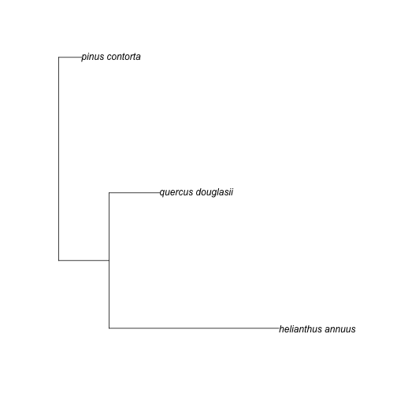

# Install taxize (uncomment to run)

```r
# install_github('taxize_', 'ropensci')
library(taxize)
library(plyr)
library(ape)
```


*********

# Phylomatic
## Fetch a phylogenetic tree from Phylomatic

```r
mytree <- "asteraceae/bidens/bidens_cernua\nasteraceae/madia/madia_exigua\nasteraceae/helianthus/helianthus_annuus"
```


## Using tree strings that need to be formatted within the function
### Return a tree in the phylo object format

```r
get_phylomatic_tree(mytree, "TRUE", "GET", "xml", "TRUE")
```

```
## 
## Phylogenetic tree with 3 tips and 2 internal nodes.
## 
## Tip labels:
## [1] "bidens_cernua"     "madia_exigua"      "helianthus_annuus"
## 	Node labels:
## [1] "euphyllophyte" ""             
## 
## Rooted; includes branch lengths.
```


### Return a tree in the phylo object format, using POST method

```r
get_phylomatic_tree(mytree, "TRUE", "POST", "xml", "TRUE")
```

```
## 
## Phylogenetic tree with 3 tips and 2 internal nodes.
## 
## Tip labels:
## [1] "bidens_cernua"     "madia_exigua"      "helianthus_annuus"
## 	Node labels:
## [1] "euphyllophyte" ""             
## 
## Rooted; includes branch lengths.
```


### Return tree in newick format

```r
get_phylomatic_tree(mytree, "TRUE", "GET", "new", "FALSE")
```

```
## [1] "(bidens_cernua:3.000000,(madia_exigua:10.000000,helianthus_annuus:5.000000):3.000000)euphyllophyte:42;"
```


### Get a tree in newick format, read using ape::read.tree, and plot

```r
tree <- get_phylomatic_tree(mytree, "TRUE", "POST", "new", "FALSE")
treephylo <- read.tree(text = tree)
plot(treephylo)
```

 


*********

# Integrated Taxonomic Informaiton Service (ITIS)
## Search by term and search type
Note: TSN stands for Taxonomic Serial Number

```r
doc <- get_itis_xml("dolphin", "comname", "name")
doc <- get_itis_xml("grizzly bear", "comnameend", "name")
doc <- get_itis_xml("ursidae", "itistermssciname", "name")
```


## Take advantage of default arguments, spaces accepted, and display data.frame output

```r
doc <- get_itis_xml("Plethodon ")
head(parse_itis(doc))
```

```
##                        sci    com    tsn
## 1         Plethodon aeneus 208328 208328
## 2     Plethodon ainsworthi 668315 668315
## 3       Plethodon albagula 208278 208278
## 4         Plethodon amplus 668316 668316
## 5 Plethodon angusticlavius 668317 668317
## 6         Plethodon asupak 685566 685566
```


## Show higher taxonomy for a given TSN

```r
classification(685566, ID = "tsn")
```

```
## [[1]]
##        rank            taxon    tsn
## 1   Kingdom         Animalia 685566
## 2    Phylum         Chordata 202423
## 3 Subphylum       Vertebrata 158852
## 4     Class         Amphibia 331030
## 5     Order          Caudata 173420
## 6    Family   Plethodontidae 173584
## 7 Subfamily   Plethodontinae 173631
## 8     Genus        Plethodon 550197
## 9   Species Plethodon asupak 173648
```


## Get a TSN from a sepcies name

```r
get_tsn(searchterm = "Quercus_douglasii", searchtype = "sciname")
```

```
##       1 
## "19322" 
## attr(,"class")
## [1] "tsn"
```


*********

# Using ITIS and Phylomatic together 
## Use ITIS and get_phymat_format to format a string for each species to be submitted to Phylomatic

```r
dat_ <- laply(list("36616", "19322", "183327"), get_phymat_format, format = "rsubmit")
dat_
```

```
## [1] "asteraceae%2Fhelianthus%2Fhelianthus_annuus"
## [2] "fagaceae%2Fquercus%2Fquercus_douglasii"     
## [3] "pinaceae%2Fpinus%2Fpinus_contorta"
```

```r
dat_mine <- paste(dat_, collapse = "%0D%0A")  # collapse and replace \n's
dat_mine
```

```
## [1] "asteraceae%2Fhelianthus%2Fhelianthus_annuus%0D%0Afagaceae%2Fquercus%2Fquercus_douglasii%0D%0Apinaceae%2Fpinus%2Fpinus_contorta"
```

```r
tree <- get_phylomatic_tree(dat_mine, "FALSE", "GET", "new", "TRUE")
tree
```

```
## 
## Phylogenetic tree with 3 tips and 2 internal nodes.
## 
## Tip labels:
## [1] "helianthus_annuus" "quercus_douglasii" "pinus_contorta"   
## 	Node labels:
## [1] "euphyllophyte" ""             
## 
## Rooted; includes branch lengths.
```

```r
plot(tree)
```

 


## A somewhat realistic workflow
### User's species list 

```r
splist <- c("annona cherimola", "annona muricata", "quercus robur", "shorea robusta", 
    "pandanus patina", "oryza sativa", "durio zibethinus")
```


### Get TSN code for each species

```r
tsns <- get_tsn(splist, "sciname")
```

```
## Warning: More then one TSN found for species 'quercus robur'.  First TSN
## used!
```

```
## Warning: More then one TSN found for species 'oryza sativa'.  First TSN
## used!
```

```r
tsns
```

```
## [1] "506198" "18098"  "19405"  "506787" "507376" "41976"  "506099"
## attr(,"class")
## [1] "tsn"
```


### Get Phylomatic formatted strings for each species

```r
dat_ <- laply(tsns, get_phymat_format, format = "rsubmit")
dat_
```

```
## [1] "annonaceae%2Fannona%2Fannona_cherimola"    
## [2] "annonaceae%2Fannona%2Fannona_muricata"     
## [3] "fagaceae%2Fquercus%2Fquercus_robur"        
## [4] "dipterocarpaceae%2Fshorea%2Fshorea_robusta"
## [5] "pandanaceae%2Fpandanus%2Fpandanus_patina"  
## [6] "poaceae%2Foryza%2Foryza_sativa"            
## [7] "malvaceae%2Fdurio%2Fdurio_zibethinus"
```


### Send strings to Phylomatic and return newick tree

```r
tree <- get_phylomatic_tree(dat_, "TRUE", "GET", "new", "TRUE")
tree
```

```
## 
## Phylogenetic tree with 7 tips and 6 internal nodes.
## 
## Tip labels:
## 	annona_cherimola, annona_muricata, quercus_robur, shorea_robusta, durio_zibethinus, pandanus_patina, ...
## 	Node labels:
## [1] "euphyllophyte"       "annona"              "poales_to_asterales"
## [4] ""                    ""                    ""                   
## 
## Rooted; includes branch lengths.
```


### Plot tree, etc. 

```r
plot(tree)
```

 


*********

# Taxonomic Name Resolution Service
## Name matching using the TNRS

```r
tnrsmatch("best", taxnames = c("helianthus annuus", "acacia", "saltea"), output = "names")  # just best names
```

```
## Hitting the TNRS API and matching names...
```

```
##        AcceptedName   MatchFam MatchGenus MatchScore    Accept?
## 1 Helianthus annuus Asteraceae Helianthus          1 No opinion
## 2            Acacia   Fabaceae     Acacia          1 No opinion
## 3                                 Saltera       0.93 No opinion
##      SubmittedNames
## 1 helianthus annuus
## 2            acacia
## 3            saltea
```


*********

# Global Names Resolver (GNR)
## Get just id's and names of sources in a data.frame

```r
tail(gnr_datasources(todf = T))
```

```
##     id                                title
## 82 164                            BioLib.cz
## 83 165 Tropicos - Missouri Botanical Garden
## 84 166                                nlbif
## 85 167  The International Plant Names Index
## 86 168              Index to Organism Names
## 87 169                        uBio NameBank
```

***
## Give me the id for EOL (Encyclopedia of Life)

```r
out <- gnr_datasources(todf = T)
out[out$title == "EOL", "id"]
```

```
## [1] 12
```

***
## Fuzzy search for sources with the word "zoo"

```r
out <- gnr_datasources(todf = T)
outdf <- out[agrep("zoo", out$title, ignore.case = T), ]
outdf[1:2, ]
```

```
##     id             title
## 20 100 Mushroom Observer
## 25 105           ZooKeys
```

***
## Resolve some names
### Search for _Helianthus annuus_ and _Homo sapiens_, return a data.frame

```r
gnr(names = c("Helianthus annuus", "Homo sapiens"), returndf = TRUE)[1:2, ]
```

```
##   data_source_id    submitted_name       name_string score    title
## 1              4 Helianthus annuus Helianthus annuus 0.988     NCBI
## 3             10 Helianthus annuus Helianthus annuus 0.988 Freebase
```

***
### Search for the same species, with only using data source 12 (i.e., EOL)

```r
gnr(names = c("Helianthus annuus", "Homo sapiens"), data_source_ids = "12", 
    returndf = TRUE)
```

```
##   data_source_id    submitted_name       name_string score title
## 1             12 Helianthus annuus Helianthus annuus 0.988   EOL
## 2             12      Homo sapiens      Homo sapiens 0.988   EOL
```


*********
# Tropicos: all Tropicos functions start with "tp_"
## 

```r
head(tp_getacceptednames(id = 25503923))
```

```
## http://services.tropicos.org/Name/25503923/AcceptedNames?apikey=e63f602b-f212-4c53-964c-94e70fb2707e&format=json
```

```
##                    variable             value category
## 1                    NameId          25503923  Synonym
## 2            ScientificName       Aira pumila  Synonym
## 3 ScientificNameWithAuthors Aira pumila Pursh  Synonym
## 4                    Family           Poaceae  Synonym
## 5                    NameId          25509881 Accepted
## 6            ScientificName         Poa annua Accepted
```

```r
head(tp_getsynonyms(id = 25509881))
```

```
## http://services.tropicos.org/Name/25509881/Synonyms?apikey=e63f602b-f212-4c53-964c-94e70fb2707e&format=json
```

```
##                    variable             value category
## 1                    NameId          25503923  Synonym
## 2            ScientificName       Aira pumila  Synonym
## 3 ScientificNameWithAuthors Aira pumila Pursh  Synonym
## 4                    Family           Poaceae  Synonym
## 5                    NameId          25509881 Accepted
## 6            ScientificName         Poa annua Accepted
```


*********
# uBio
## Search uBio using the namebank_search API method.

```r
ubio_namebank_search(searchName = "elephant", sci = 1, vern = 0)
```

```
## Error: $ operator is invalid for atomic vectors
```

```r
head(ubio_namebank_search(searchName = "Helianthus annuus", sci = 1, vern = 0)[, 
    -c(2, 3)])
```

```
## Error: $ operator is invalid for atomic vectors
```

```r
out <- lapply(list("Helianthus debilis", "Astragalus aduncus"), function(x) ubio_namebank_search(searchName = x, 
    sci = 1, vern = 0))
```

```
## Error: $ operator is invalid for atomic vectors
```

```r
head(out[[2]][, -c(2, 3)])  # just Astragalus aduncus output
```

```
## Error: incorrect number of dimensions
```

